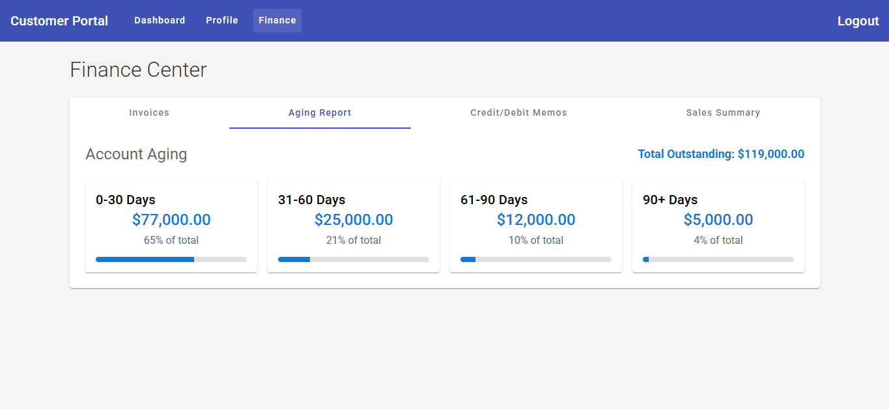

# Customer Portal (SD + FI)

A web-based Angular app integrating SAP SD & FI modules to manage customer data, view transactions, sales orders, delivery details, and financial statements. Provides a complete customer-business interaction overview.

## UI Frontend

